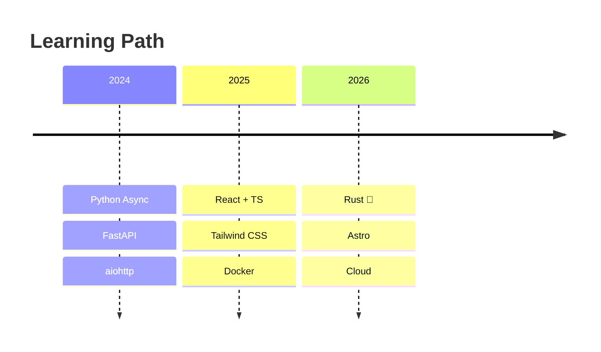
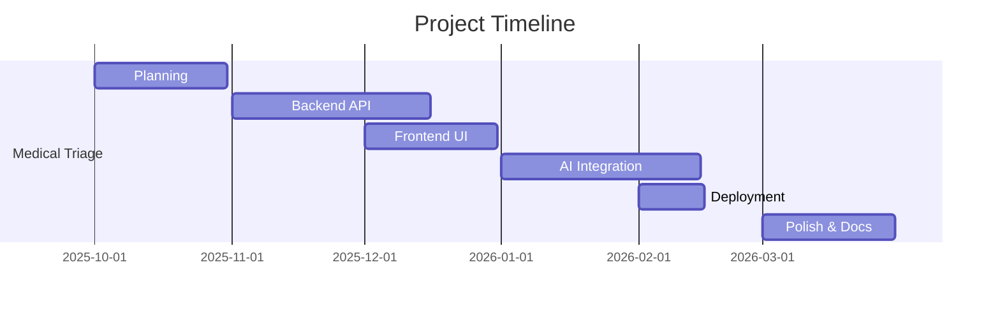

# 🚀 0xProgress

<div align="center">
  
**Building in public — one bug at a time.**

I'm on a path from open source contributor to paid developer. Currently diving deep into Python async systems, with Rust on the horizon.

[](https://github.com/0xProgress)
[](https://twitter.com/0xProgress)
[](mailto:progressuwhuseba@gmail.com)
[](https://linkedin.com/in/0xProgress)

</div>

---

## 🏗️ Current Project

### 🤖 AI Medical Triage
> Privacy-first, open-source conversational AI for initial medical triage


[](https://ai-medical-triage-dab8.onrender.com)
[](https://github.com/0xProgress/AI-Medical-Triage)

---

## 📊 GitHub Stats

<div align="center">

| 🟢 Merged | 🟡 Open | 📝 Issues |
|:---:|:---:|:---:|
| 0 | 0 | 0 |

</div>

### Recent Merged PRs
*No merged PRs yet — working on it.*

---

## 🛠️ Tech Stack

<div align="center">

### Current Stack

[](https://python.org)
[](https://fastapi.tiangolo.com)
[](https://reactjs.org)
[](https://typescriptlang.org)

[](https://tailwindcss.com)
[](https://docker.com)
[](https://linux.org)
[](https://git-scm.com)

</div>

---

## 📚 Learning Journey



---

## 📦 Featured Projects

### 🤖 AI Medical Triage
**Privacy-first medical AI assistant**
- 🔒 Zero data retention
- 🧠 Qwen 2.5-7B integration
- 📄 PDF report generation
- 🌐 Deployed on Render

[](https://github.com/0xProgress/AI-Medical-Triage)

---

## 📈 Activity Graph



---

## 🎯 Goals

### 2026 Roadmap

- [x] Build AI Medical Triage MVP
- [x] Deploy on Render
- [ ] Contribute to 5 open source projects
- [ ] Learn Rust fundamentals
- [ ] Take on a competition
- [ ] Get first paid open source contribution

---

## 💡 Philosophy

```python
def build():
    # Fix the root cause, not the symptom
    root_cause = find_root()
    fix(root_cause)
    
    # Every PR gets a test
    if pr_exists():
        write_tests()
    
    # Consistency > intensity
    build_habit(daily_commits=1)
    
    return progress
```

### Principles

- 🔍 Fix the root cause, not the symptom
- 🧪 Every PR gets a test
- 📅 Consistency > intensity
- 📝 Document everything

---

## 📫 Connect With Me

<div align="center">

[](https://github.com/0xProgress)
[](https://twitter.com/0xProgress)
[](mailto:progressuwhuseba@gmail.com)
[](https://linkedin.com/in/0xProgress)

</div>

---

<div align="center">

**💬 Let's Connect**

Whether you have a Python project with "good first issues," want to collaborate on async tools, or just want to talk shop — I'm always open to chat.

---

*Building in public — one bug at a time.* 🚀

</div>
